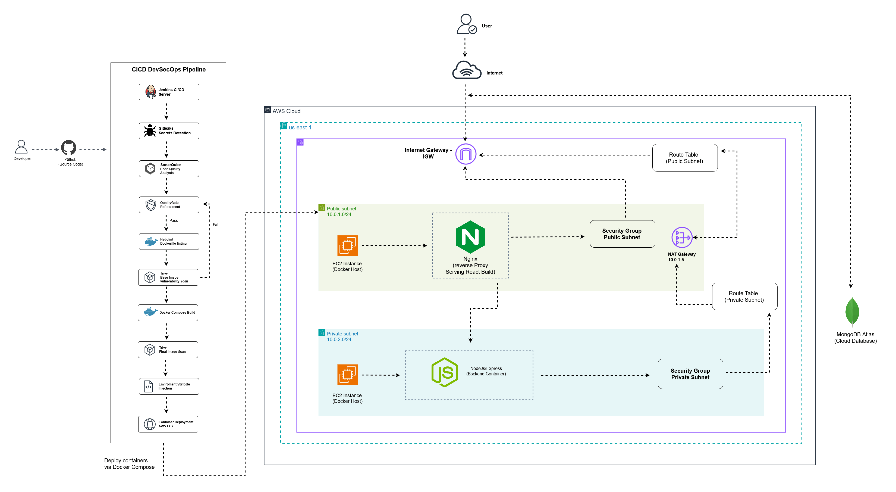
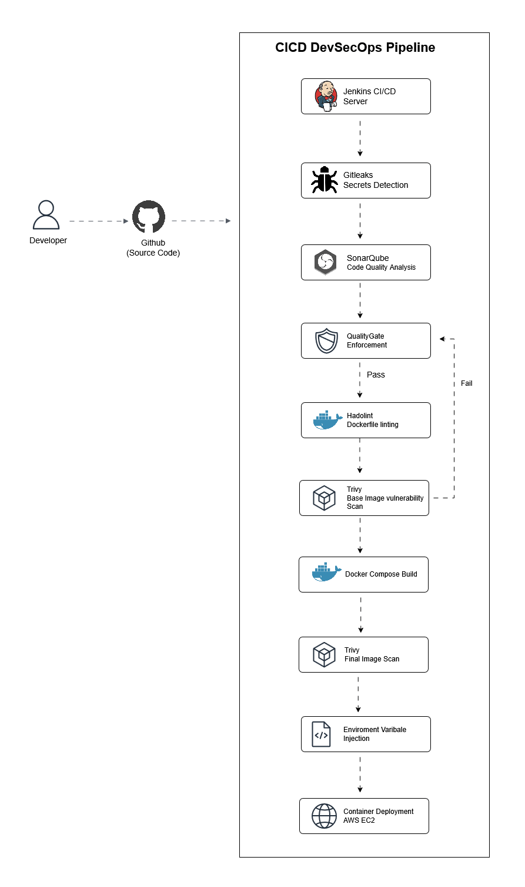

# 🚀 Cloud-Native DevSecOps: MERN Task Management System


## 📌 Project Overview
This project is a production-grade deployment of a **MERN Stack Task Management Application**. It features a highly secure **AWS VPC Architecture**, containerized delivery with **Docker**, and a robust **DevSecOps pipeline**.

The goal was to move beyond simple deployment and focus on **security**, **network isolation**, and **infrastructure efficiency**.

---

## 🏗️ Architecture Design

The infrastructure is built on AWS with a security-first mindset:

* **Custom VPC:** Separated into **Public** and **Private** subnets.
* **Public Subnet:** Hosts the **Nginx Reverse Proxy** and the React frontend.
* **Private Subnet:** Isolates the **Backend API**, making it unreachable from the public internet for maximum security.
* **NAT Gateway:** Allows private instances to securely fetch updates from the internet.
* **Internet Gateway (IGW):** Manages external traffic to the frontend.

---

## 🛡️ DevSecOps & Security Integration
I integrated the following tools to ensure the application is secure from code to container:

1.  **Gitleaks:** Scans the repo to prevent sensitive secrets or API keys from being leaked.
2.  **SonarQube:** Performs static code analysis to maintain high code quality and find bugs.
3.  **Trivy:** Scans Docker images and the filesystem for known vulnerabilities before deployment.

---

## 🐳 Container Optimization
I used **Multi-Stage Docker Builds** to optimize the application's footprint:
* **Result:** Reduced the Frontend image size by **60-70%**.
* **Benefit:** Faster deployment times, lower storage costs, and a smaller attack surface.

---

## 🛠️ Tech Stack
* **Frontend:** React.js
* **Backend:** Node.js, Express.js
* **Database:** MongoDB Atlas
* **Infrastructure:** AWS (EC2, VPC, NAT Gateway, IGW)
* **Reverse Proxy:** Nginx
* **Containerization:** Docker, Docker Compose
* **Security Tools:** Gitleaks, SonarQube, Trivy

---

## Deployment Workflow ☁️


---

## 🚀 How to Run Locally

### 1. Clone the repository
```bash
git clone https://github.com/sachilz/Secure-Multi-Tier-MERN-Deployment-AWS.git
cd Secure-Multi-Tier-MERN-Deployment-AWS
```
### 2. Set up Environment Variables
Create a .env file in the backend directory and add your MongoDB URI
```bash
MONGO_URI=your_mongodb_connection_string
PORT=5000
```

### 3. Run with Docker Compose
```bash
docker-compose up --build -d
```
